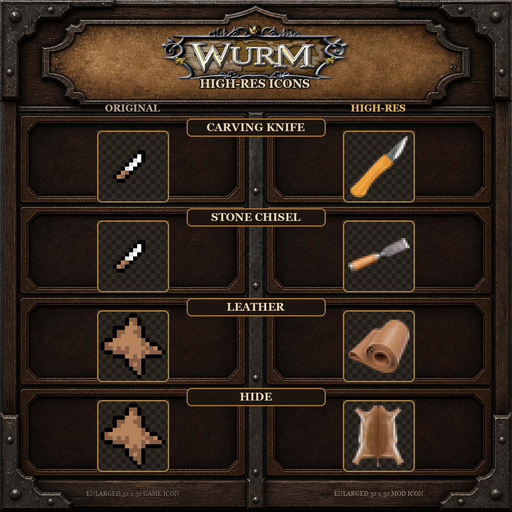

# WURM High-Res Icons



WURM High-Res Icons is a client-side visual mod for Wurm Unlimited. It replaces low-detail interface icons with carefully redrawn 32×32 artwork, provides separate icons for items that share the same vanilla icon (such as pelt, hide, leather and dragon hides), and adds animated rarity effects.

## Features

- Detailed 32×32 icons for Inventory, Toolbelt, Equipment and Build/Creation windows, including backpack, bladder, fat, feather, fur, gland, hoof, horn, leather knife, paw, quiver, satchel, tail, tooth, twisted horn and water skin.
- Separate artwork for many items that share one vanilla icon ID, including carving knife / stone chisel, small / large anvil, leather / hide / pelt, bladder / gland, horn / twisted horn, pottery bowl / smelting pot, press / fruit press and several barrel types.
- Separate muted-color drake-hide and dragon-scale icons for black, blue, green, red and white dragons.
- Six shield renders from the original game meshes. Wood and metal materials are recoloured at runtime from one base icon and one mask per shape, without storing per-colour duplicates.
- Material-aware metal and wood regions on every eligible redesigned item: blades, tool heads, brush bristles, wooden handles, staves and frames use the item's actual game material while other parts remain unchanged. Each artwork still needs only one neutral base and one mask.
- Animated rare, supreme and fantastic highlighting: irregular pulsing blob (default) or rotating five-point star, with an optional white shimmer.
- Magic water skins and Santa sacks have their own animated diamond-like rainbow refraction and a moving sunlight glint (`magicShimmer=true`).
- Runtime resource packs: the mod does not overwrite `packs/graphics.jar`.
- Visual compatibility with Smart Improve and Archaeology Identify. The mod does not alter item template IDs, improve logic or archaeology data.

## Requirements

- Wurm Unlimited client.
- [Ago's Client ModLauncher](https://github.com/ago1024/WurmClientModLauncher/releases) installed for the client.
- The game client must be closed during installation.

## Download and installation

Download the latest ZIP from [GitHub Releases](https://github.com/chamomilo/wurm-high-res-icons/releases/latest).

1. Close Wurm Unlimited.
2. Extract `WURM-High-Res-Icons-0.1.31.zip` into the `WurmLauncher` folder.
3. Keep the included `mods` directory structure.
4. Start the client through Ago's Client ModLauncher.

The realistic icon set and pulsing blob rarity effect are enabled by default. The former exaggerated/readable alternate set is no longer included. Advanced settings are available in `mods/wurm-highres.properties`; restart the client after changing them.

## Building

The build needs Java 8 and local Wurm client libraries. Copy `local.properties.example` to `local.properties`, set `wurmClientLibDir`, then run:

```text
gradlew.bat clean test publicationZip
```

## Author and license

Created by **Chamomilo**.

Licensed under **GNU LGPL 3.0 or later**. See [`lgpl-3.0.txt`](lgpl-3.0.txt).

## Chamomilo versions

Version 0.1.31 embeds the shared Chamomilo updater. A versions window opens at every launch after the HUD is ready and lists all mods from the public GitHub catalogue, including disabled and absent installations. UPDATE opens a newer installed release; INSTALL opens a release for an absent mod. ZIP installation remains manual. The public catalogue is refreshed without requiring new client binaries; a verified copy is retained for offline startup. All Chamomilo updater copies share one window, with a thin high-resolution wood-and-metal frame.
